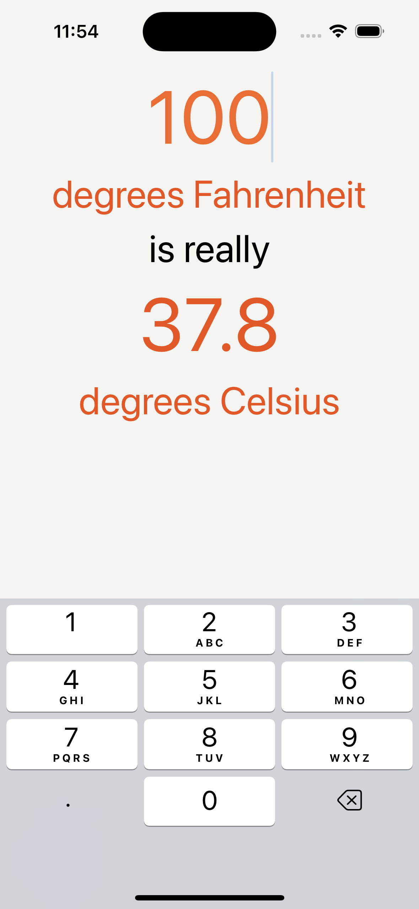

# WorldTrotter
WorldTrotter is a project from the textbook "iOS Programming: The Big Nerd RanchGuide" by Christian Keur and Aaron Hillegass. 

The WorldTrotter project covered views and view hierarchy, auto layout, view controllers, programmatic implementations, text input, delegations, localization, and internalization.

The WorldTrotter application introduces the user with a Fahrenheit to Celsius conversion calculator.

The second tab, Map, shows the map of the world with three different view options: Standard, Hybrid, and Satellite.

The third tab, Quiz, has three questions and answers. The user can reveal the answer when they think they are ready to answer.

The application is also available in Spanish.

